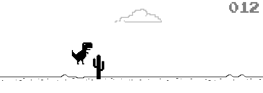

Python Games on Microcontroller
==============================

Write your own game with python and microcontroller.

Thanks to Adafruit's CircuitPython, we can quckly write a python game running on a microcontroller.

The repo contains python games running on + [nRF52840 M.2 devkit](https://store.makerdiary.com/products/nrf52840-m2-developer-kit)
## [Dino](Dino)

A clone of Chrome's dinosaur game (`chrome://dino`) with a carrot.

## Credits
+ [CircuitPython](https://github.com/adafruit/circuitpython)