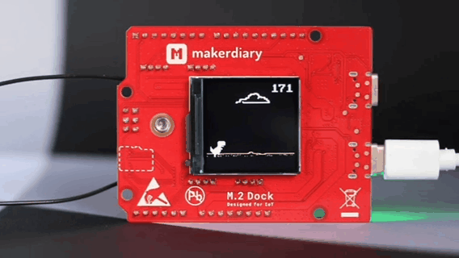

# Dino 🦖

A clone of Chrome's dinosaur game (`chrome://dino`) runs on a microcontroller and is written by Python.



## Hardware
+ [Makerdiary nRF52840 M.2 devkit](https://store.makerdiary.com/products/nrf52840-m2-developer-kit)

## Requirements
+ [Adafruit CircuitPython ImageLoad](https://github.com/adafruit/Adafruit_CircuitPython_ImageLoad)

## Setup
1.  Download [Adafruit CircuitPython ImageLoad](https://github.com/adafruit/Adafruit_CircuitPython_ImageLoad) and put the `adafruit_imageload` folder into the `lib` directory of the `CIRCUITPY` drive
2.  copy `dino.py` and the `img` folder to the `CIRCUITPY` drive
3.  Change `code.py` to:

    ```
    import dino
    ```

The file tree is like:

``` sh
CIRCUITPY
├── boot_out.txt
├── code.py
├── dino.py
├── img
│   ├── cactus15x32.bmp
│   ├── cactus24x50.bmp
│   ├── cloud92x27.bmp
│   ├── digital200x25.bmp
│   ├── dinosaur132x47.bmp
│   ├── game_over190x10.bmp
│   └── ground512x12.bmp
└── lib
    └── adafruit_imageload
```

## Go further 🥕
We can make the game more interactive with touch sensing.
For example, we can use a carrot 🥕 as a touch key to play the game.


To get it work, copy `dino_with_touch.py` to the `CIRCUITPY` drive and change `code.py` to:

```
import dino_with_touch
```

You may need to adjust the touch threshold in `dino_with_touch.py`

```
touch = touchio.TouchIn(board.D8)
touch.threshold = 100

# uncomment this to find out the right threshold
# while True:
    # value = touch.raw_value
    # print((value))
    # time.sleep(0.01)
```

Instead of using a carrot 🥕, you can also use apple 🍎, banana 🍌, potato 🥔 and etc.
